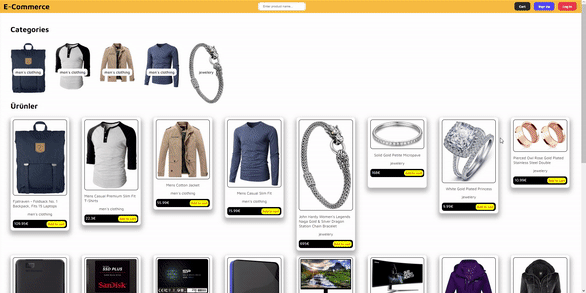

# E-commerce Web Site

I created a e-commerce site. In the design, I implemented the dynamics with JavaScript along with CSS. 

As stated in the design, I added the products to my project via API. Then I separated them according to their categories.
When we added the products to the cart, I was able to make more than one selection along with the quantity information. Finally, I showed the amount of the selected products dynamically in the total section.

<h2>Used Tech.</h2> 
<ul>
  <li>HTML was used.</li>
  <li>CSS was used in design.</li>
  <li>Javascript was used in dynamics.</li>
</ul>
<h2>Screen</h2>

